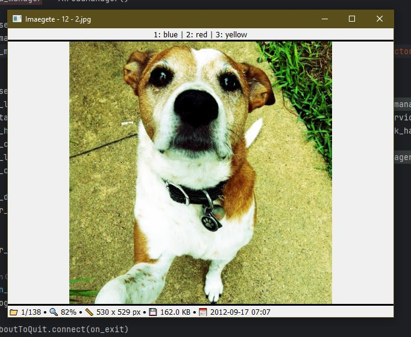

# Imaegete - Image Viewer and Sorting Application

Imaegete is a Qt-based image management and sorting application. It allows users to organize, view, move, and delete images using customizable categories. The app is designed to be both a GUI and command-line utility with various configurable options.

## Features
- Organize images into custom categories
- Delete and move images to predefined folders
- Use keyboard shortcuts for fast navigation
- Supports configuration via CLI arguments and YAML config file
- Logging of all operations for tracking

## Screenshots


## Installation

### Requirements
The following dependencies are required to run the application:

- Python 3.10+
- colorama==0.4.6
- confumo https://github.com/actx4gh/confumo
- exceptiongroup==1.2.2
- glavnaqt https://github.com/actx4gh/GlavnaQt
- iniconfig==2.0.0
- natsort==8.4.0
- packaging==24.1
- pluggy==1.5.0
- PyQt6-Qt6==6.7.2
- PyQt6_sip==13.8.0
- pytest==8.3.2
- PyYAML==6.0.2
- tomli==2.0.1
- watchdog==5.0.3

Install the dependencies using the `requirements.txt` file:

```bash
pip install -r requirements.txt
```

### Running the Application

You can run the application from the command line with various options either by specifying command-line arguments or by using a configuration file.

#### 1. Running with CLI Arguments

```bash
python main.py --categories cat1 cat2 --start_dirs /path/to/images --log_dir /path/to/logs --cache_dir /path/to/cache
```

##### Available CLI Arguments:
- `--categories`: A list of categories to organize images into.
- `--sort_dir`: Base directory to put sorting folders. Defaults to the starting directory.
- `--start_dirs`: The directory where images are stored. Defaults to the current working directory.
- `--log_dir`: Directory where logs are stored. Defaults to the config/logs directory.
- `--cache_dir`: Directory where cached data is stored. Defaults to the config/cache directory.
- `--config`: Path to the YAML configuration file for loading settings (alternative to CLI options).

Example:
```bash
python main.py --categories cats dogs --start_dirs ./images --log_dir ./logs --cache_dir ./cache
```

#### 2. Running with Configuration File

You can specify the configuration file by using the `--config` option:

```bash
python main.py --config config.yaml
```

##### Example Config File (YAML):

```yaml
categories:
  - Category1
  - Category2
log_dir: /path/to/logs
cache_dir: /path/to/cache
start_dirs: 
  - /path/to/images
sort_dir: /path/to/sorted
```

This configuration allows you to preload settings instead of passing them as CLI arguments.

### Logging
By default, all operations are logged in the `imaegete.log` file (or another specified log location). You can check the logs for any errors or operations performed by the application.

### Keyboard Shortcuts

The following keyboard shortcuts are available for quick navigation and management of images:

| Action                | Key         |
|-----------------------|-------------|
| Next Image            | Right       |
| Previous Image        | Left        |
| First Image           | Home        |
| Last Image            | End         |
| Random Image          | R           |
| Delete Image          | Delete      |
| Undo Last Action      | U           |
| Toggle Fullscreen     | F           |
| Toggle Slideshow      | S           |
| Quit Application      | Q           |

These shortcuts can be used within the GUI to perform operations quickly.

## Slideshow Feature

### Overview

The application now includes a slideshow mode that automatically cycles through images at a set interval. Users can control the direction of image cycling (next, previous, or random) and manually set the cycling rate by tapping the appropriate shortcut keys multiple times. When the slideshow is turned off, the cycling rate resets to its default value of 3 seconds.

### Slideshow Controls:

- **Toggle Slideshow On/Off**: Press the `S` key to start or stop the slideshow.
- **Manual Image Cycling**: Use the following shortcut keys to manually cycle through images:
    - **Next Image**: [Specify the key, e.g., Right Arrow or another key]
    - **Previous Image**: [Specify the key, e.g., Left Arrow or another key]
    - **Random Image**: [Specify the key, e.g., `R` or another key]

### Manual Rate Setting:

- To manually set the cycling rate, press any of the cycle shortcut keys twice in succession. The interval between the key presses will become the new cycling rate.
- After 1 minute of inactivity, the manual rate setting times out if only pressed once


### Development

To contribute to this project, clone the repository and install the dependencies as specified in the `requirements.txt`.

#### Running Tests

The project contains unit tests that are written using `pytest`. To run the tests, execute the following:

```bash
pytest
```

The tests cover key components like configuration parsing, image handling, and logging.

## License

This project is licensed under the MIT License. See the `LICENSE` file for more details.


